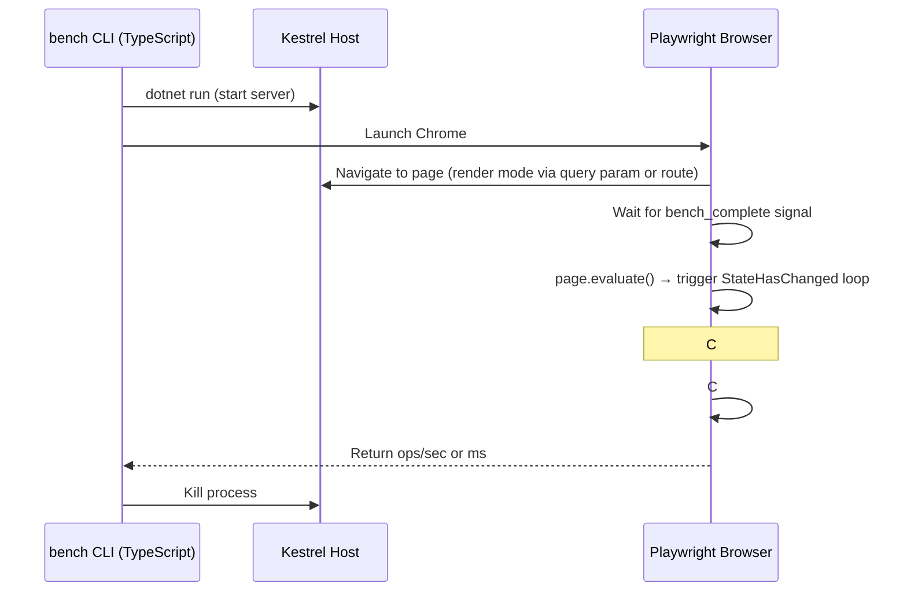

# Plan: `blazor-perf` Benchmark App

## Summary

New app `blazor-perf` that measures Blazor rendering performance (parameter propagation, component tree overhead) across **three rendering modes**: Interactive WebAssembly, Interactive Server, and Static SSR. Uses a real Kestrel host. Also absorbs the 8 throughput benchmarks currently in `empty-blazor`.

Reference: [dotnet/aspnetcore#66505](https://github.com/dotnet/aspnetcore/issues/66505), [hakenr/BlazorPerformanceTuningDemos](https://github.com/hakenr/BlazorPerformanceTuningDemos)

---

## Scenarios

### 1. ParametersCount (from hakenr)
- 10,000 components × 10 string parameters each
- Measures `SetParametersAsync` overhead per render cycle
- Baseline: `TableCell_ManyParameters` (reflection-based, default)
- Variant: `TableCell_ManyParameters_Optimized` (manual switch/case)
- Reports: **renders/sec** (how many full re-renders in duration window)

### 2. TooManyComponents (from hakenr)
- 1,000 nested component instances (TableRow → TableCell × 3 with child content)
- Measures component tree instantiation and diff overhead
- Reports: **renders/sec**

### 3. Migrated from EmptyBlazor (Redesigned)

The current EmptyBlazor throughput tests have two problems:
1. **60Hz throttle**: Counter/VirtualScroll renders are so light that Chrome's display refresh rate (60Hz) becomes the bottleneck, even with `--disable-frame-rate-limit` Playwright args. Fix: make each render heavy enough that it takes **≥100ms**, so frame rate is irrelevant.
2. **High variance**: Interop tests (JS↔CS) show wild swings (10k–25k ops/sec between runs). Fix: batch operations into longer measurement windows, use median of multiple runs, and ensure sufficient warmup.

**Redesigned scenarios:**
- ~~Counter clicks/sec~~ → **Counter Heavy**: Each "click" renders 5,000 child components. Measures render throughput where each frame is ≥100ms.
- ~~Virtual Scroll/sec~~ → **VirtualScroll Heavy**: Virtualize with 10,000 items × complex row template. Each scroll-triggered render is ≥100ms.
- JS→CS Number/String/JSON → **Keep but fix**: Batch 10,000 ops per measurement sample. Take median of 5 samples. Minimum 2s warmup before measurement.
- CS→JS Number/String/JSON → **Keep but fix**: Same batching + median approach.

### Measurement Stability Rules

Apply to ALL scenarios in blazor-perf:

| Rule | Rationale |
|------|-----------|
| Each render must take **≥100ms** | Eliminates display refresh rate as bottleneck; timer resolution is not a factor |
| Warmup: discard first N renders (until stable) | JIT/interpreter warmup skews early samples |
| Report **median** of 5+ samples (not min, not mean) | Outlier-resistant; GC pauses affect individual samples |
| Measurement window ≥ 5 seconds | Long enough to average out GC pauses and OS scheduling |
| Interop: batch 10,000+ ops per sample | Amortizes per-call overhead; reduces timer noise |
| No reliance on `requestAnimationFrame` timing | Renders are driven by `StateHasChanged` loop, not frame callbacks |

---

## Rendering Modes

| Mode | Host | Measurement Approach |
|------|------|---------------------|
| **Interactive WASM** | Kestrel serves Blazor Web App | Playwright: C# Stopwatch timing reported via JSInterop |
| **Interactive Server** | Kestrel + SignalR | Playwright: same C# Stopwatch, result sent to client via SignalR |
| **Static SSR** | Kestrel renders on server | HTTP client: measure server response time for full page HTML |
| **HtmlRenderer** | In-process (no HTTP) | C# benchmark harness: direct `HtmlRenderer.RenderComponentAsync` timing |

### Multi-threaded Stress Dimension

For **SSR**, **HtmlRenderer**, and **Interactive Server** modes, we add a parallel sessions stress variant. This measures throughput under concurrent load (realistic for server scenarios).

**Synchronized start**: All sessions connect and become ready first, then are unleashed simultaneously (barrier pattern). This ensures we measure true concurrent load, not staggered startup.

| Mode | Stress Driver | Approach |
|------|--------------|----------|
| **SSR ×100** | Node.js `fetch` | 100 concurrent HTTP requests fired via `Promise.all` after barrier, measure requests/sec. **Validated**: Node.js `maxSockets` defaults to `Infinity`; no client-side throttling. |
| **HtmlRenderer ×10** | In-process C# | Server-side endpoint runs `Task.WhenAll` of 10 parallel `RenderComponentAsync` calls, reports renders/sec via HTTP response (100 causes thread pool starvation) |
| **Interactive Server ×25** | Playwright iframes | 25 iframes load and signal ready, then all triggered simultaneously via `postMessage` broadcast |

#### Interactive Server ×25: Synchronized Iframe Approach

One Playwright page hosts 25 `<iframe>` elements, each loading the Blazor app as a separate SignalR circuit.

**Ready-then-unleash protocol:**
1. Parent page creates 25 iframes pointing to the benchmark URL
2. Each iframe's Blazor app completes startup and posts `{ type: 'ready' }` to parent via `window.parent.postMessage`
3. Parent waits until all 25 have reported ready (barrier)
4. Parent broadcasts `{ type: 'go' }` to all iframes via `iframe.contentWindow.postMessage`
5. Each iframe begins its `StateHasChanged` render loop simultaneously
6. Each iframe posts `{ type: 'result', ops }` when its measurement window completes
7. Parent aggregates all 25 results → total ops/sec

**Why 25 for Interactive Server**: Standard GH Actions runners (2 vCPU / 7 GB RAM). Each iframe runs a full Blazor circuit with DOM rendering + SignalR connection. 25 iframes × ~80 MB = ~2 GB for browser + Kestrel with 25 SignalR circuits comfortably fits. SSR and HtmlRenderer don't need browser resources so they can stay at 100. Session count configurable via `--stress-sessions` flag.

---

## Architecture

### App Structure (`src/blazor-perf/`)

```
src/blazor-perf/
├── BlazorPerf.csproj               # Blazor Web App (server + client)
├── Program.cs                       # Kestrel host with all three render modes
├── Components/
│   ├── App.razor                    # Root with render mode switching
│   ├── _Imports.razor
│   └── Layout/
│       └── MainLayout.razor
├── BlazorPerf.Client/               # Client project — all tested components live here
│   ├── BlazorPerf.Client.csproj
│   ├── _Imports.razor
│   ├── Pages/
│   │   ├── Home.razor               # Landing page (signals ready)
│   │   ├── Counter.razor            # Migrated from empty-blazor
│   │   ├── Weather.razor            # Migrated (interop benchmarks)
│   │   ├── ParametersCount.razor    # New: 10k × 10 params scenario
│   │   └── TooManyComponents.razor  # New: 1k nested components
│   ├── Shared/
│   │   ├── MeasuredComponentBase.cs # Stopwatch timing base class
│   │   ├── TableCell_ManyParameters.razor
│   │   ├── TableCell_Optimized.razor
│   │   ├── TableRow.razor
│   │   └── TableCell.razor
│   └── wwwroot/
│       └── Pages/
│           └── Weather.razor.js     # Interop bench functions
└── wwwroot/
    ├── main.js                      # Bench hooks (like empty-blazor)
    └── Pages/
        └── Weather.razor.js         # Interop bench functions
```

### Measurement Flow



### Key Difference from Current Apps

| Aspect | Current (empty-blazor) | New (blazor-perf) |
|--------|------------------------|-------------------|
| Hosting | Static file server (Node.js) | Kestrel (`dotnet run`) |
| Build output | `dotnet publish` → static files | `dotnet publish` → self-contained app |
| Server start | `startStaticServer()` in measure.ts | `startKestrelServer()` — new helper |
| Render modes | WASM only | WASM, Server, SSR |
| Timing | Browser-side (Console.WriteLine detection) | C# Stopwatch → JSInterop report |

---

## New Metrics

| MetricKey | Display Name | Unit | Category |
|-----------|-------------|------|----------|
| `blazor-params-count-wasm` | Params Count (WASM) | ops/sec | throughput |
| `blazor-params-count-server` | Params Count (Server) | ops/sec | throughput |
| `blazor-params-count-server-stress` | Params Count (Server ×25) | ops/sec | throughput |
| `blazor-params-count-ssr` | Params Count (SSR) | ops/sec | throughput |
| `blazor-params-count-ssr-stress` | Params Count (SSR ×100) | ops/sec | throughput |
| `blazor-params-count-htmlrenderer` | Params Count (HtmlRenderer) | ops/sec | throughput |
| `blazor-params-count-htmlrenderer-stress` | Params Count (HtmlRenderer ×10) | ops/sec | throughput |
| `blazor-too-many-components-wasm` | Many Components (WASM) | ops/sec | throughput |
| `blazor-too-many-components-server` | Many Components (Server) | ops/sec | throughput |
| `blazor-too-many-components-server-stress` | Many Components (Server ×25) | ops/sec | throughput |
| `blazor-too-many-components-ssr` | Many Components (SSR) | ops/sec | throughput |
| `blazor-too-many-components-ssr-stress` | Many Components (SSR ×100) | ops/sec | throughput |
| `blazor-too-many-components-htmlrenderer` | Many Components (HtmlRenderer) | ops/sec | throughput |
| `blazor-too-many-components-htmlrenderer-stress` | Many Components (HtmlRenderer ×10) | ops/sec | throughput |

Migrated metrics (redesigned, new keys — old `empty-blazor` keys deprecated):
- `blazor-counter-heavy` — Counter Heavy (5k child components per render), renders/sec
- `blazor-virtualscroll-heavy` — VirtualScroll Heavy (10k items), renders/sec
- `blazor-js-to-cs-number`, `blazor-js-to-cs-string`, `blazor-js-to-cs-json` — batched 10k ops, median of 5 samples, ops/sec
- `blazor-cs-to-js-number`, `blazor-cs-to-js-string`, `blazor-cs-to-js-json` — batched 10k ops, median of 5 samples, ops/sec

---

## Implementation Phases

### Phase 1: App Scaffold + Migrated Benchmarks
1. Create `src/blazor-perf/` as Blazor Web App with WASM render mode
2. Migrate Counter + Weather (interop) pages from `empty-blazor`
3. Add `MeasuredComponentBase` for Stopwatch timing
4. Add `blazor-perf` to `App` enum, `APP_CONFIG`, build pipeline
5. Add Kestrel launcher helper in `bench/src/lib/`
6. Wire walkthroughs in `measure.ts` for the migrated benchmarks
7. Remove migrated walkthrough entries from `empty-blazor` in measure.ts
8. Update bench-viewer `DashboardConfig` with new app

### Phase 2: ParametersCount Scenario
1. Create `TableCell_ManyParameters.razor` (10 params) — standalone, no Havit
2. Create `ParametersCount.razor` page — 10k rows with re-render loop
3. C# timing: `Stopwatch.StartNew()` before `StateHasChanged()`, stop in `OnAfterRender`
4. Report via JSInterop: `globalThis.benchParamsCount(ms)` → returns renders completed
5. Add new metric keys to `enums.ts`, `metrics.ts`
6. Add walkthrough function in `bench/src/lib/blazor-perf-bench.ts`

### Phase 3: TooManyComponents Scenario
1. Create `TableRow.razor`, `TableCell.razor` — simple child-content wrappers
2. Create `TooManyComponents.razor` — 1000 rows × 4 cells with icons
3. Same measurement pattern: C# Stopwatch + StateHasChanged loop
4. Add metric keys and walkthrough function

### Phase 4: Server + SSR + HtmlRenderer Rendering Modes
1. Add `InteractiveServer` render mode support to the Blazor Web App
2. Route-based mode switching: `/params-count?mode=wasm|server|ssr`
3. For Server: Playwright navigates, C# timing still works (SignalR delivers result)
4. For SSR: TypeScript fires HTTP requests, measures response time (no interactivity)
5. Add `HtmlRenderer` endpoint: `POST /api/bench/render?scenario=params-count` — runs `HtmlRenderer.RenderComponentAsync` in-process, returns render time
6. Update Kestrel launcher to handle SignalR

### Phase 5: Multi-threaded Stress ✅
1. SSR stress: TypeScript fires 100 concurrent `fetch()` via `Promise.all` to SSR endpoint, reports aggregate requests/sec
2. HtmlRenderer stress: `GET /api/bench/html-render-stress?scenario=...&parallel=10` — server runs `Task.WhenAll` of 10 renders, reports renders/sec (reduced from 100 due to `Dispatcher.InvokeAsync` thread pool starvation at high parallelism)
3. Interactive Server stress: Single Playwright page with 25 iframes, synchronized start via `postMessage` barrier, aggregate ops/sec across all circuits
4. Add new stress metric keys
5. `ThreadPool.SetMinThreads(200, 200)` added to Program.cs as safety net

**Validated results (mono / coreclr):**
- SSR ×100 Params Count: 2654 / 2875 req/s
- SSR ×100 Too Many Components: 274 / 319 req/s
- HtmlRenderer ×10 Params Count: 8772 / 8609 renders/s
- HtmlRenderer ×10 Too Many Components: 1134 / 1305 renders/s
- Server ×25 Params Count: 561 / 557 renders/s
- Server ×25 Too Many Components: 134 / 129 renders/s

### Phase 6: Dashboard + CI ✅
1. ✅ `blazor-perf` tab in bench-viewer — already in `DashboardConfig.AppOrder` and `BlazorApps`
2. ✅ `transform-views` auto-discovers metrics from result files — no changes needed
3. ✅ CI workflow uses dynamic matrix from `build-manifest.json` — blazor-perf included automatically
4. ✅ Added all rendering metric definitions to `MetricInfo.cs` (20 metrics: counter-heavy, virtualscroll-heavy, params-count, too-many-components across WASM/Server/SSR/HtmlRenderer + stress variants)
5. ✅ Added SSR/HtmlRenderer/stress metric keys to `DashboardConfig.MetricOrder`
6. Note: `blazor-perf` is never deployed to GH pages (unlike other apps); empty-blazor throughput metrics left as-is (still useful for basic WASM load timing)

### Phase 7: OTEL Server-Side Metrics Collection ✅
Collect .NET runtime and ASP.NET Core performance counters from the Kestrel host during stress runs. Report alongside throughput numbers to correlate rendering perf with server health.

**Metrics to collect:**

| Category | Metric | Source (EventCounter / Meter) |
|----------|--------|-------------------------------|
| **GC Pressure** | Gen0/1/2 collection count | `System.Runtime` / `gc-gen0-count` etc. |
| | GC pause time (ms) | `System.Runtime` / `time-in-gc` |
| | Allocation rate (bytes/sec) | `System.Runtime` / `alloc-rate` |
| | Managed heap size | `System.Runtime` / `gc-heap-size` |
| | LOH size | `System.Runtime` / `loh-size` |
| **Lock Contention** | Monitor lock contentions/sec | `System.Runtime` / `monitor-lock-contention-count` |
| **Thread Pool** | ThreadPool queue length | `System.Runtime` / `threadpool-queue-length` |
| | ThreadPool thread count | `System.Runtime` / `threadpool-thread-count` |
| | ThreadPool work items/sec | `System.Runtime` / `threadpool-completed-items-count` |
| **CPU** | Process CPU usage (%) | `System.Runtime` / `cpu-usage` |
| | Working set (bytes) | `System.Runtime` / `working-set` |
| **ASP.NET Core** | Active requests | `Microsoft.AspNetCore.Hosting` / `current-requests` |
| | Request duration (ms) | `Microsoft.AspNetCore.Hosting` / `requests-per-second` |
| | Failed requests | `Microsoft.AspNetCore.Hosting` / `failed-requests` |
| **Kestrel** | Active connections | `Microsoft-AspNetCore-Server-Kestrel` / `connections-per-second` |
| | Connection queue length | `Microsoft-AspNetCore-Server-Kestrel` / `connection-queue-length` |
| **SignalR** | Active hub connections | `Microsoft.AspNetCore.Http.Connections` / `connections-started` |

**Implementation approach:**
1. Enable `dotnet-counters`-style collection via `EventPipe` in the Kestrel host
2. Expose a `GET /api/bench/metrics` endpoint that returns current counter values as JSON
3. TypeScript bench CLI polls this endpoint at start/end of stress window, computes deltas
4. Report as additional metrics alongside throughput (e.g. `blazor-params-count-server-stress-gc-gen0`, `blazor-params-count-server-stress-lock-contentions`)
5. Alternative: Use `dotnet-trace` sidecar process with EventPipe provider filters, parse output after run

**What this tells us:**
- **GC pressure** → Are rendering allocations causing stop-the-world pauses under load?
- **Lock contention** → Is the Blazor circuit/renderer hub contending on shared state?
- **Thread pool saturation** → Are we starving the thread pool with 100 concurrent renders?
- **Memory growth** → Does per-circuit state leak under sustained load?

**Implementation (completed):**
1. ✅ `EventCounterCollector.cs` — `EventListener` subclass capturing `System.Runtime`, `Microsoft.AspNetCore.Hosting`, `Microsoft-AspNetCore-Server-Kestrel` counters at 1s interval
2. ✅ `/api/bench/metrics` endpoint — returns `Dictionary<string, double>` as JSON
3. ✅ `fetchOtelSnapshot()` + `computeOtelDeltas()` in `blazor-perf-bench.ts` — fetches before/after stress, computes meaningful deltas (cumulative counters: delta; gauges: after value; sizes: MB conversion)
4. ✅ All 6 stress walkthroughs return `WalkthroughWithOtel` — `measure.ts` stores as `{stress-key}-otel-{counter}` dynamic metric keys
5. ✅ `MetricInfo.cs` dynamic OTEL display — parses `-otel-` suffix pattern, shows e.g. "Params Count (SSR ×100) · GC Gen0"
6. ✅ 11 counters tracked: heap-mb, gc-gen0/1/2, gc-pause-pct, alloc-rate, lock-contentions, threadpool-threads, threadpool-queue, cpu-pct, working-set-mb

---

## Open Questions / Risks

1. **Kestrel lifetime management**: Need robust start/stop in CI. Plan: use `Process.Start` with health check endpoint, kill on dispose.
2. **HtmlRenderer as render mode**: Expose via an API endpoint on the same Kestrel host. The endpoint instantiates `HtmlRenderer`, renders the component, and returns timing. No browser needed for this mode.
3. **Interactive Server ×25 memory**: 25 iframes × ~80 MB + Kestrel with 25 SignalR circuits ≈ 2-3 GB — fits comfortably on standard GH Actions runners (7 GB). SSR/HtmlRenderer stress at 100 is fine since they don't need browser resources.
4. **Node.js fetch throttling**: **Not an issue.** Node.js `http.Agent.maxSockets` defaults to `Infinity`; global `fetch()` (undici) also has no connection limit. 100 concurrent localhost fetches proceed in parallel without queuing.
5. **Build time impact**: Consistent with all other apps (tracked via compile-time metric). Only difference: never deployed to GH pages.
6. **Warmup**: Rendering benchmarks are sensitive to JIT warmup (Server) and interpreter warmup (WASM). Need warmup iterations before measurement.
7. **Presets**: `no-workload` for all rendering modes. `aot` additionally for WASM mode only. Server/SSR/HtmlRenderer don't use wasm-tools workload.
8. **OTEL overhead**: EventPipe collection adds ~1-2% overhead. Acceptable for stress benchmarks where we're measuring throughput, not latency precision. Disable for single-session benchmarks.

---

## Files to Modify

| File | Change |
|------|--------|
| `bench/src/enums.ts` | Add `BlazorPerf` to `App` enum, new `MetricKey`s, update `APP_CONFIG` |
| `bench/src/lib/metrics.ts` | Add new metric metadata |
| `bench/src/stages/measure.ts` | Add walkthrough entries for blazor-perf, remove migrated ones from empty-blazor |
| `bench/src/lib/blazor-perf-bench.ts` | New file: all bench functions for blazor-perf |
| `bench/src/lib/kestrel-server.ts` | New file: start/stop Kestrel process |
| `src/blazor-perf/**` | New app directory |
| `src/AllApps.proj` | Include blazor-perf |
| `src/bench-viewer/Models/DashboardConfig.cs` | Add blazor-perf to AppOrder, BlazorApps |
| `.github/workflows/benchmark.yml` | Add blazor-perf to matrix |
